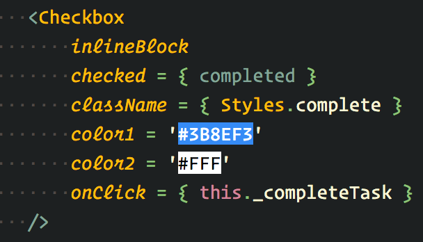

# Интенсив по React: персональный проект

Этот репозиторий — отправная точка для выполнения твоего персонального проекта. Весь полученный опыт ты успешно применишь на практике. Тебя ждет увлекательное приключение, так что не медли.

---

## Чтобы отправиться в путь:

*   `git clone git@github.com:Lectrum/react-personal-project.git`
*   `cd react-personal-project`
*   `yarn` или `npm i`
*   `yarn start` или `npm start`

---

Документация к API доступна по [ссылке](https://lab.lectrum.io/docs/hw/todo/).

---

В директории `source/instruments` находится компонент высшего порядка `withSvg` — он использован для декорирования SVG-компонентов, чтобы их использовать в приложении в дальнейшнем. Декорированные компоненты-SVG назодятся в директории `source/theme/assets`.

Пример использования:

---

## Чтобы задеплоить приложение на github pages:

*   Запуши репозиторий с приложением на github
*   В файле `package.json`, в скрипте `build:prod-github` — укажи значение переменной окружения `REPOSITORY_NAME` в виде имени своего репозитория на github
*   Затем — `yarn deploy` или `npm run deploy`

---

###### Заметка: после деплоя, приложение будет доступно по адресу:

> `https://имя-твоего-пользователя-гитхаб.github.io/имя-твоего-репозитория-с-приложением`

---

## Чтобы сбилдить приложение без github pages:

*   `yarn build:prod` или `npm run build:prod`
